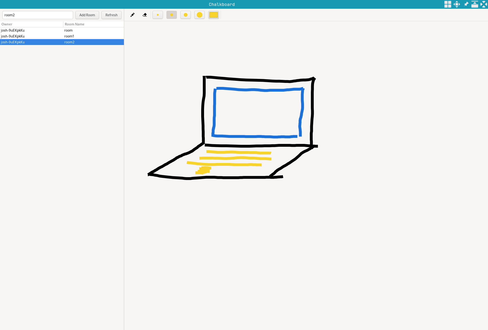

# chalkboard

Peer to peer (P2P) distributed whiteboard. 
Utilises [libp2p][libp2p] mDNS and pubsub to manage the peer to peer communication.

## Features

- Clients can create and join rooms, each of which has a canvas.
- Clients discover other clients and rooms automatically.

## Credits

Icons from [UXWing][uxwing]

[uxwing]: https://uxwing.com
[libp2p]: https://libp2p.io
